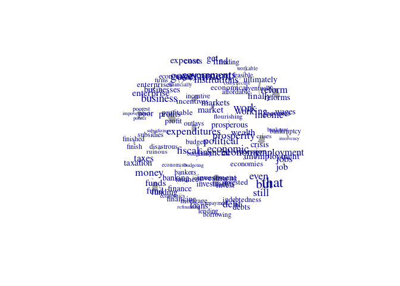

README.Rmd
================

# Ça va, CAVA? Dictionary Coherence, Augmentation, (Validation and Analysis)

CAVA is an R package to assit in working with dictionary
(keywords/lexical text analysis) in a valid way. It allows you to use an
embeddings model to do dictionary expansion/augmentation, check its
coherence, (and at some future date) validation and analysis.

For a longer description, see our [ICA Tool Demo
abstract](CAVA_ICA_abstract.pdf).

## Installing and obtaining an embeddings model

You can install CAVA from github:

``` r
remotes::install_github("vanatteveldt/CAVA")
```

Before starting, you need an embeddings model. Currently, we only
support Fasttext .bin models. The code below downloads an English
fasttext model:

``` r
if (!file.exists("cc.en.300.bin")) {
  url = "https://dl.fbaipublicfiles.com/fasttext/vectors-crawl/cc.en.300.bin.gz"
  options(timeout=4300)  # assuming 1Mb/s
  download.file(paste0(url), destfile = "cc.en.300.bin.gz")
  R.utils::gunzip("cc.en.300.bin.gz") # Install R.utils if needed
}
```

# Using CAVA

The main functions exposed to cava are shown below. For a more elaborate
example, please see the [example usage file](usage.md).

Loading the FastText mnodel, using the state of the union speeches as
target corpus:

``` r
library(CAVA)
corpus = quanteda::corpus(sotu::sotu_text, docvars = sotu::sotu_meta)
vectors = load_fasttext("cc.en.300.bin", corpus)
```

## Augmentation

Expanding a dictionary using wildcard and similarity:

``` r
dictionary = c("fin*", "eco*")
dictionary = expand_wildcards(dictionary, vectors)
candidates = similar_words(dictionary, vectors)
dictionary = c(dictionary, candidates$word[candidates$similarity>.4])
head(candidates)
```

| word        | similarity |
|:------------|-----------:|
| investment  |  0.5263631 |
| investments |  0.5070851 |
| monetary    |  0.5067791 |
| money       |  0.5034836 |
| ultimately  |  0.4815412 |
| profitable  |  0.4813354 |

Expanding a dictionary using antonyms:

``` r
positive = c("good", "nice", "best", "happy")
negative = c("evil", "nasty", "worst", "bad", "unhappy")
candidates = similar_words(positive, vectors, antonyms = negative)
head(candidates)
```

| word      | similarity |
|:----------|-----------:|
| great     |  0.6968333 |
| better    |  0.6371742 |
| decent    |  0.6344477 |
| excellent |  0.6282948 |
| wonderful |  0.6057519 |
| perfect   |  0.6032647 |

## Coherence

Computing and plotting pairwise similarities:

``` r
similarities = pairwise_similarities(dictionary, vectors)
similarities |> similarity_graph(max_edges=100) |> plot()
```

<!-- -->

Computing similarity to dictionary centroid (sorted with most distances
words on top):

``` r
similarity_to_centroid(dictionary, vectors) |> head()
```

| word     | similarity |
|:---------|-----------:|
| finished |  0.1932090 |
| finish   |  0.2300643 |
| findings |  0.2401340 |
| finest   |  0.2455174 |
| fine     |  0.2593122 |
| finds    |  0.2703327 |
