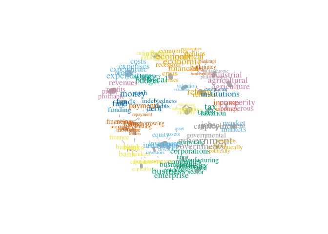
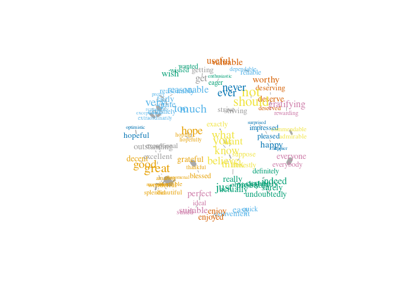
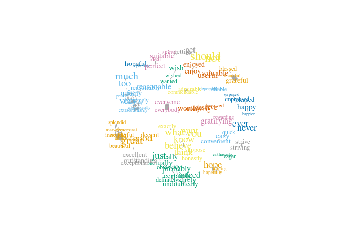

usage.Rmd
================

# Using CAVA for dictionary expansion and analysis

This example shows how CAVA can be used to expand and check dictionaries
using word embeddings. In particular, we will try to do dictionary
expansion on both topic keywords and a (naive) sentiment dictionary. For
both use cases, we use the freely available State of the Union corpus as
a target corpus, which is used by CAVA to limit the vocabulary and for
word frequencies.

## Setting up

To get started, install CAVA and download the
[cc.en.300.bin](https://dl.fbaipublicfiles.com/fasttext/vectors-crawl/cc.en.300.bin.gz)
FastText model:

``` r
remotes::install_github("vanatteveldt/CAVA")
if (!file.exists("cc.en.300.bin")) {
  url = "https://dl.fbaipublicfiles.com/fasttext/vectors-crawl/cc.en.300.bin.gz"
  options(timeout=4300)  # assuming 1Mb/s
  download.file(paste0(url), destfile = "cc.en.300.bin.gz")
  R.utils::gunzip("cc.en.300.bin.gz") # Install R.utils if needed
}
```

Let’s load the State of the Union (SotU) corpus using the `quanteda` and
`sotu` packages:

``` r
library(quanteda)
corpus = corpus(sotu::sotu_text, docvars = sotu::sotu_meta) |> corpus_reshape(to="paragraphs")
docvars(corpus) |> head()
```

| president         | year | years\_active | party       | sotu\_type |
|:------------------|-----:|:--------------|:------------|:-----------|
| George Washington | 1790 | 1789-1793     | Nonpartisan | speech     |
| George Washington | 1790 | 1789-1793     | Nonpartisan | speech     |
| George Washington | 1790 | 1789-1793     | Nonpartisan | speech     |
| George Washington | 1790 | 1789-1793     | Nonpartisan | speech     |
| George Washington | 1790 | 1789-1793     | Nonpartisan | speech     |
| George Washington | 1790 | 1789-1793     | Nonpartisan | speech     |

Now, we can load the vectors from the FastText model. Note that if you
don’t specify a vocabulary, CAVA will use all or the top-n words in the
embeddings model. Also note that this may take up to a minute and
consume quite a bit of memory (\~8GB on my machine). If necessary, you
can specify `n=1000` to only use the thousand most frequent words, but
of course that means you might miss a lot of useful words.

``` r
library(CAVA)
library(tidyverse)
vectors = load_fasttext("cc.en.300.bin", corpus)
```

The `vectors` object is a list with two items: the embedding `vectors`
and the `vocabulary`:

``` r
dim(vectors$vectors)
vectors$vectors[1:10, 1:10]
vectors$vocabulary
```

# Dictionary Expansion

Suppose we want to find paragraphs related to finances. We could start
with all words containing `*financ*` or `*econo*`:

``` r
dictionary = c("*financ*", "*econo*")
dictionary = expand_wildcards(dictionary, vectors)
dictionary
```

    ##  [1] "economic"     "economy"      "financial"    "finance"      "finances"    
    ##  [6] "economical"   "financing"    "economies"    "economically" "financed"    
    ## [11] "economics"    "economists"   "financially"  "refinancing"

As you can see, this adds a number of words related to financial or
economic matters. Now, we can treat this as a ‘seed set’ and use the
embedding vectors to find words that are *semtantically* similar to the
words in the seed set:

``` r
candidates = similar_words(dictionary, vectors)
head(candidates)
```

| word        | similarity | frequency |
|:------------|-----------:|----------:|
| investments |  0.6082434 |       108 |
| investment  |  0.6035968 |       255 |
| monetary    |  0.5733044 |       121 |
| debt        |  0.5598368 |       791 |
| banking     |  0.5443530 |       145 |
| business    |  0.5413670 |      1325 |

That looks sensible: investment, business, banking etc. all seem likely
expansion candidates. Now, it is a good idea to manually check these
words before adding them to the dictionary and determine a good
similarity threshold and/or manually add valid terms. However, for this
exercise let’s just add all terms with a similarity of at least 0.4:

``` r
dictionary = c(dictionary, candidates$word[candidates$similarity>.4])
length(dictionary)
```

    ## [1] 182

# Coherence

To check the (face) validity of this new dictionary, we can compute the
internal coherence of the terms. For example, we can compute the
similarity of each term to the ‘centroid’ (average meaning) of all
terms:

``` r
similarity_to_centroid(dictionary, vectors) |> head()
```

| word            | similarity | frequency |
|:----------------|-----------:|----------:|
| politically     |  0.3201907 |        19 |
| self-sustaining |  0.4001081 |        24 |
| industrialized  |  0.4116970 |        20 |
| environmental   |  0.4199668 |       108 |
| economically    |  0.4200296 |        57 |
| politics        |  0.4228533 |        90 |

This is sorted by increasing similarity, so it shows the most distant
words first. It is probably a good idea to manually check at least the
words that are least similar and/or most frequent. For example,
*environmental*, *politics*, and *politically* are probably not very
good terms for a dictionary to find statements about the economy, while
(especially the first two) they are relatively frequent. So, checking
and removing these words is an easy way to increase the validity of your
dictionary.

You can also compute the pairwise similarities between all terms:

``` r
similarities = pairwise_similarities(dictionary, vectors)
head(similarities)
```

| word1        | word2       | similarity | frequency1 | frequency2 |
|:-------------|:------------|-----------:|-----------:|-----------:|
| profit       | profits     |  0.8532221 |         96 |        143 |
| reform       | reforms     |  0.8513784 |        632 |        177 |
| subsidies    | subsidy     |  0.8510590 |         54 |         34 |
| investment   | investments |  0.8472053 |        255 |        108 |
| crises       | crisis      |  0.8367514 |         31 |        174 |
| agricultural | agriculture |  0.8363140 |        405 |        470 |

You can plot this as a network graph:

``` r
g = similarity_graph(similarities, max_edges = 150) 
plot(g)
```

<!-- -->

You can also create an interactive plot using the `networkD3` package.
For this, we create a node list and edge list. Note that the edges need
to use a zero-based index for the node rather than its name. We also
compute a slightly sub-linear size:

``` r
library(networkD3)
g = similarity_graph(similarities, threshold=.55) 
nodes = igraph::as_data_frame(g, what='vertices') %>%
  mutate(size=n^.75)
edges = igraph::as_data_frame(g, what='edges') %>%
  mutate(from=match(from, nodes$name)-1,
         to=match(to, nodes$name)-1)
```

Now, we can plot this as e.g. a force network: (see the network3D
package for more options)

``` r
forceNetwork(Links = edges, Nodes = nodes, 
             NodeID = 'name', Group = 'cluster', Nodesize='size',
             fontSize = 10, zoom = TRUE, linkDistance = 30, 
             opacityNoHover=.75, opacity=.75)
```

This visualization is a great way to find and explore clusters of
related terms. Of course, it is up to the researcher whether these terms
or clusters should be included, but this tool can help get a better
feeling for which words are included in the (expanded) dictionary.

# Expansion and antonyms: creating a sentiment dictionary

If we use the similarity techniques to expand a (very naive) sentiment
dictionary, we quickly see that it sees antonyms as semantically
related:

``` r
positive = c("good", "nice", "best", "happy")
similar_words(positive, vectors) |> head()
```

| word      | similarity | frequency |
|:----------|-----------:|----------:|
| great     |  0.6968333 |      3410 |
| better    |  0.6371742 |       905 |
| decent    |  0.6344477 |        81 |
| excellent |  0.6282948 |        68 |
| bad       |  0.6188114 |       111 |
| wonderful |  0.6057519 |        31 |

Of course, we don’t want a word like `bad` to be included in the
positive sentiment word list. A way to improve this is to also define a
list of antonyms (a negative seed list):

``` r
negative = c("evil", "nasty", "worst", "bad", "unhappy")
candidates = similar_words(positive, vectors, antonyms = negative)
positive2 = c(positive, candidates$word[candidates$similarity>.4])
pairwise_similarities(positive2, vectors) |> 
  similarity_graph(max_edges=100) |> 
  plot()
```

<!-- -->

This already looks fairly good. However, we probably don’t want words
like ‘too’, ‘not’ or ‘never’ included. So, let’s add these to our
negative list and retry:

``` r
negative = c(negative, "not", "never", "too", "get")
candidates = similar_words(positive, vectors, antonyms = negative)
positive3 = c(positive, candidates$word[candidates$similarity>.4])
pairwise_similarities(positive2, vectors) |> 
  similarity_graph(max_edges=100) |> 
  plot()
```

<!-- -->

This already looks better. Of course, we should never simply add all
these words, especially for sentiment dictionaries it is important to
check all words before adding them, and then of course validate the
result. Using this list of expansion candidates, however, can help solve
the recall problems present in many sentiment dictionaries.
